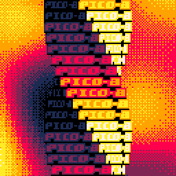

# Everyday One Motion - 20160714 "Plasma and Twister"

PICO-8

[Everyday One Motion](http://motions.work/motion/317)  
[Cartridge](http://www.lexaloffle.com/bbs/?tid=3816)  

## Plasma and Twister

今回は、PlasmaとTwisterという、どちらもDemosceneでは頻繁に用いられるエフェクトを使ってみました。  
背景がPlasma、前景がTwisterですよ。  

## Plasma

Plasmaは、なんというか、うねうねしたエフェクトです。  
[Wikipedia](https://en.wikipedia.org/wiki/Plasma_effect) には、「液体的、有機的な動きに見える」というように言語化されています。  
実装は [bidouille.org](http://www.bidouille.org/prog/plasma) が詳しいです。  
結局何をやっているかというと、平面上に線形・円形など、複数のサイン波を作り、それらをすべて足しあわせているだけです。非常に簡単なアルゴリズムですが、とても気持ち悪い動きを作ることができます。　　

## Twister

Twisterは、細長い直方体をねじるようなエフェクトです。  
y軸ごとに回転量を決め、回転量に応じて横長の線を描画することによってできます（説明が難しい……）  
回転量は、たとえば `y * 0.1 * sin( t + 0.3 ) + t * 3.0` のように、 `y` と `t` の複雑な関数にすることが重要です。  

PICO-8は、スプライトの拡大・縮小がどうやらとても簡単にできるようでしたので、せっかくなのでスプライトを用いたTwisterとしてみました。  
